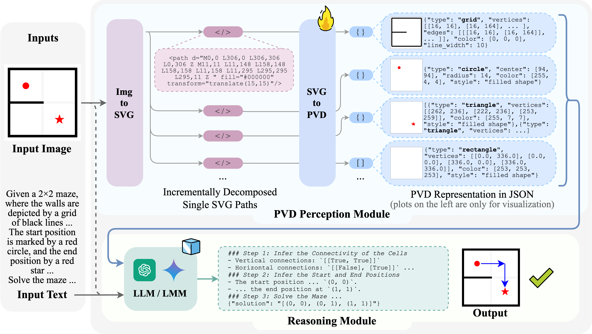

<h1 align="center"> Text-Based Reasoning About Vector Graphics </h1>

<p align="center">
<a href="https://mikewangwzhl.github.io/vdlm.github.io/">🌐 Homepage</a>
•
<a href="">📃 Paper</a>
•
<a href="https://huggingface.co/datasets/mikewang/PVD-160K" >🤗 Data (PVD-160k)</a>
•
<a href="https://huggingface.co/mikewang/PVD-160k-Mistral-7b" >🤗 Model (PVD-160k-Mistral-7b)</a>
•
<a href="https://github.com/MikeWangWZHL/VDLM" >💻 Code</a>

</p>

We propose **VDLM**, a text-based visual reasoning framework for vector graphics. VDLM operates on text-based visual descriptions—specifically, SVG representations and learned Primal Visual Descriptions (PVD), enabling zero-shot reasoning with an off-the-shelf LLM. We demonstrate that VDLM outperforms state-of-the-art large multimodal models, such as GPT-4V, across various multimodal reasoning tasks involving vector graphics. See our [paper]() for more details.



## 💻 Environment Setup
- Minimum requirements:
    ```
    conda env create -f environment.yml
    conda activate vdlm
    ```
- (Optional) For llava inference:
    ```
    cd third_party
    git clone https://github.com/haotian-liu/LLaVA.git
    cd LLaVA
    pip install -e .
    ```
- (Optional) For ViperGPT inference:
    ```
    cd third_party
    git clone https://github.com/MikeWangWZHL/viper.git
    ```  
    Set up the environment for ViperGPT following the instructions.
    

## 🚀 Quick Start (Inference Demo)

- Download the pretrained SVG-to-PVD model (a finetuned Mistral-7B) from [here](https://huggingface.co/mikewang/PVD-160k-Mistral-7b). Make sure it is stored at `data/ckpts/PVD-160k-Mistral-7b`
    ```
    mkdir -p data/ckpts
    cd data/ckpts
    git lfs install
    git clone https://huggingface.co/mikewang/PVD-160k-Mistral-7b
    ```

- Serve the model with vllm:
    ```
    export CUDA_VISIBLE_DEVICES=0
    bash vllm_serve_model.sh
    ```

- A detailed inference demo 🚀 can be found [here](demo.ipynb).

<!-- - Run inference to obtain PVD perception results and prompts for reasoning. Example usage:
    ```
    python inference_perception.py \
        --img_path demo_examples/image_inputs/lines_segments.png \
        --question "How many line segments are there in the image? What's the total length of all the line segments in the image?" \
        --output_root demo_examples/perception_output
    ```

    The output will be in `demo_examples/perception_output/{served_model_name}/{img_name}` containing:

    - `input_img.png`: the input image
    - `svg/`: a subdir containing the converted raw SVG file of the entire image, and individual SVG files with decomposed single paths ("path_*.svg"). 
    - `output_perception/`:
        - `responses.json`: a JSON file containing the PVD perception results
        - `pred_all.png`: a visualization of the aggregated perception of the entire image
        - `pred_path_*.png`: visualizations of the perception of each individual object
    - `prompt_for_reasoning.txt`: prompt with the inserted perception result and the task instruction for feeding into an LLM, e.g., GPT-4.  -->

## 📊 Downstream Task Evaluation

### Downstream Task Data Download
You can download the data for downstream tasks from [here](https://huggingface.co/datasets/mikewang/VDLM-raw/blob/main/downstream_tasks.zip). Unzip the file and place the `downstream_tasks` folder under `data/datasets/`.

### Run VDLM Perception: Image -> SVG -> PVD (in JSON format)
```
bash scripts/perception/eval_perception.sh    
```

### Run Reasoning: PVD + question -> answer

- VDLM:
    - GPT-4 Chat API *without* Code Interpreter:
        ```
        bash scripts/reasoning/gpt4_pvd.sh
        ```
    - GPT-4 Assistant API *with* Code Interpreter:
        ```
        bash scripts/reasoning/gpt4_assistant_pvd.sh
        ```
    
- Image-based Baselines:
    - GPT-4v + Image input: 
        ```
        bash scripts/reasoning/gpt4v_image.sh
        ```
    - Llava-v1.5 + Image input:
        ```
        # 7b
        bash scripts/reasoning/llava_1.5_7b_image.sh
        # 13b
        bash scripts/reasoning/llava_1.5_13b_image.sh
        ```
    - ViperGPT w/ GPT-4 + Image input:
        ```
        bash scripts/reasoning/vipergpt_inference.sh
        ```

## 📂 SVG-to-PVD Model Data

### PVD-160k Dataset
The dataset used for training our [SVG-to-PVD model](https://huggingface.co/mikewang/PVD-160k-Mistral-7b) can be downloaded from [here](https://huggingface.co/datasets/mikewang/PVD-160K), which contains the preprocessed instruction-tuning data instances for training the SVG-to-PVD model. The format of each line is as follows:
```
{
    "id": "XXX",
    "conversations": [
        {"role": "system", "content": "XXX"},
        {"role": "user", "content": "XXX"},
        {"role": "assistant", "content": "XXX"}
        // ...
    ]
}
```

Additioanlly, the raw PNGs, SVGs and PVD annotations generated by our data generator can be downloaded from [here](https://huggingface.co/datasets/mikewang/VDLM-raw/blob/main/pvd_160k_raw.zip).
<!-- By default, the dataset is stored in `data/datasets/pretraining_data/pvd_160k.jsonl`. -->

### Generating custom PVD data
`pvd_data_generator/generate_pvd_img_svg.py` provides the procedural data generator we used for generating the 160K Image/SVG/PVD pairs. 

Example usage: `bash pvd_data_generator/gen_dataset_pvd_160K.sh`

To specify custom configurations, one can modify the `main()` function in `pvd_data_generator/generate_pvd_img_svg.py`.

Once generated the SVGs and PVD annotations, one can use the `pvd_data_generator/get_instruction_pair.py` to construct instruction-tuning data instances in vicuna or openai/mistral format. Modify the `#TODO` parts in the script with the generated custom dataset information. Then run: `python pvd_data_generator/get_instruction_pair.py`


## 📘 SVG-to-PVD Model Training
We finetune a Mistral-7B model using Megatron-LLM on the [PVD-160K dataset](#pvd-160k-dataset).
We follow https://github.com/xingyaoww/code-act/blob/main/docs/MODEL_TRAINING.md for doing the preprocessing and postprocessing on the model and data. We train the model on a SLURM cluster with 4 NVIDIA-A100-40GB GPUs.

Example usage:
- clone the code-act repo:
    ```
    cd third_party
    git clone https://github.com/xingyaoww/code-act.git
    ```
- Follow the instructions in https://github.com/xingyaoww/code-act/blob/main/docs/MODEL_TRAINING.md#environment-setup; for environmental setup, model preprocessing, data conversion.

- Modify the `TODO:` items in `scripts/training/finetune_4xA100_4tp_mistral__pvd_3ep.slurm` and `scripts/training/finetune_4xA100_4tp_mistral__pvd_3ep.sh`

- Copy `scripts/training/finetune_4xA100_4tp_mistral__pvd_3ep.slurm` into `code-act/scripts/slurm/configs`; Copy `scripts/training/finetune_4xA100_4tp_mistral__pvd_3ep.sh` into `code-act/scripts/models/megatron`.

- Run training by:
    ```
    cd third_party/code-act
    sbatch scripts/slurm/configs/finetune_4xA100_4tp_mistral__pvd_3ep.slurm scripts/models/megatron/finetune_4xA100_4tp_mistral__pvd_3ep.sh
    ```

- Follow https://github.com/xingyaoww/code-act/blob/main/docs/MODEL_TRAINING.md#convert-back-to-huggingface-format to convert the trained model back to Huggingface format. The converted model can be served with `vllm` for inference.


## 📚 Citation

```bibtex
```